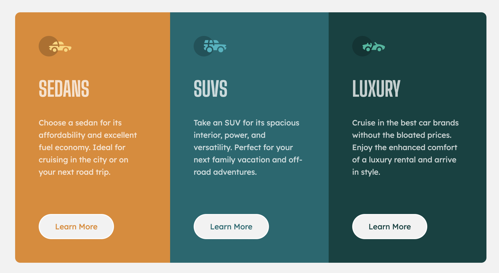

# Frontend Mentor - 3-column preview card component solution

This is a solution to the [3-column preview card component challenge on Frontend Mentor](https://www.frontendmentor.io/challenges/3column-preview-card-component-pH92eAR2-). Frontend Mentor challenges help you improve your coding skills by building realistic projects.

## Table of contents

- [Overview](#overview)
  - [The challenge](#the-challenge)
  - [Screenshot](#screenshot)
  - [Links](#links)
- [My process](#my-process)
  - [Built with](#built-with)
  - [What I learned](#what-i-learned)
- [Author](#author)

## Overview

### The challenge

Users should be able to:

- View the optimal layout depending on their device's screen size
- See hover states for interactive elements

### Screenshot

### Links

- Solution URL: [https://www.frontendmentor.io/solutions/mobile-first-responsive-3column-preview-card-using-html-and-css-GxtWwg1BsI](https://www.frontendmentor.io/solutions/mobile-first-responsive-3column-preview-card-using-html-and-css-GxtWwg1BsI)
- Live Site URL: [https://frontend-mentor-3-column-six.vercel.app/](https://frontend-mentor-3-column-six.vercel.app/)

## My process

### Built with

- Semantic HTML5 markup
- CSS custom properties
- Flexbox
- Mobile-first workflow

### What I learned

## Author

- Website - [Yeji Kim](https://github.com/yjkim0109)
- Frontend Mentor - [@yjkim0109](https://www.frontendmentor.io/profile/yjkim0109)
