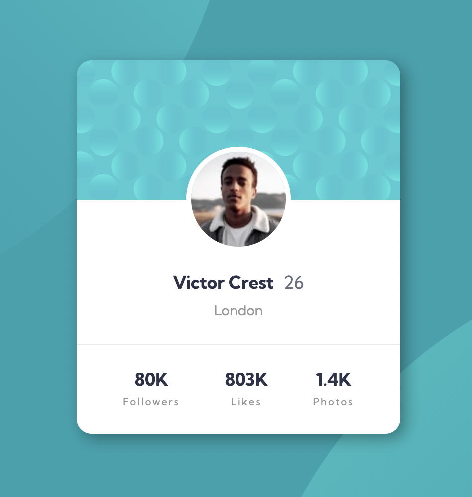

# Frontend Mentor - Profile card component solution

This is a solution to the [Profile card component challenge on Frontend Mentor](https://www.frontendmentor.io/challenges/profile-card-component-cfArpWshJ). Frontend Mentor challenges help you improve your coding skills by building realistic projects.

## Table of contents

- [Overview](#overview)
  - [The challenge](#the-challenge)
  - [Screenshot](#screenshot)
  - [Links](#links)
- [My process](#my-process)
  - [What I learned](#what-i-learned)
- [Author](#author)

## Overview

### The challenge

- Build out the project to the designs provided

### Screenshot



### Links

- Solution URL: [https://www.frontendmentor.io/challenges/profile-card-component-cfArpWshJ/hub/mobile-first-profile-card-using-html-and-css-Z6WpL1RHpq](https://www.frontendmentor.io/challenges/profile-card-component-cfArpWshJ/hub/mobile-first-profile-card-using-html-and-css-Z6WpL1RHpq)
- Live Site URL: [https://frontend-mentor-profile-card-two-omega.vercel.app/](https://frontend-mentor-profile-card-two-omega.vercel.app/)

## My process

### Built with

- Semantic HTML5 markup
- CSS custom properties
- Flexbox
- Mobile-first workflow

### What I learned

```css
body {
  background-color: hsl(185, 75%, 39%);
  background-image: url(./images/bg-pattern-top.svg),
    url(./images/bg-pattern-bottom.svg);
  background-repeat: no-repeat, no-repeat;
  background-position: right 50vw bottom 40vh, left 50vw top 50vh;
}
```

## Author

- Website - [Yeji Kim](https://github.com/yjkim0109)
- Frontend Mentor - [@yjkim0109](https://www.frontendmentor.io/profile/yjkim0109)
